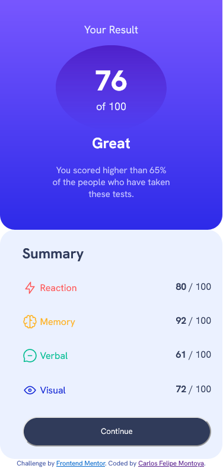
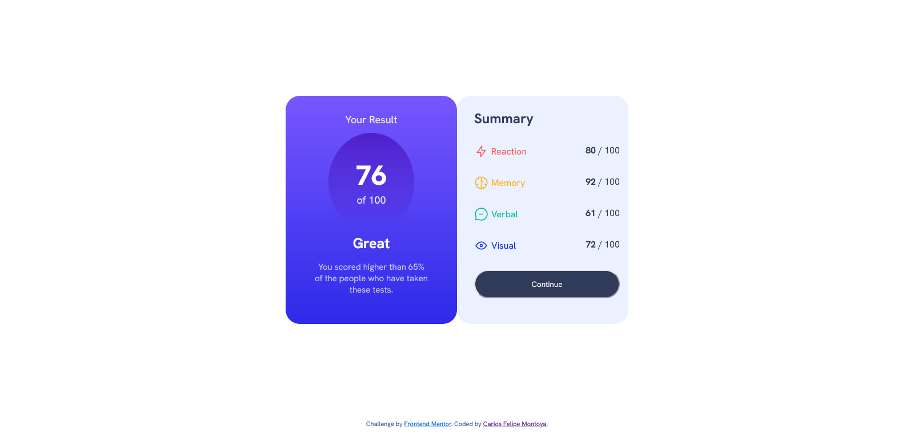

# Frontend Mentor - Results summary component solution

This is a solution to the [Results summary component challenge on Frontend Mentor](https://www.frontendmentor.io/challenges/results-summary-component-CE_K6s0maV). Frontend Mentor challenges help you improve your coding skills by building realistic projects. 

## Table of contents

- [Overview](#overview)
  - [The challenge](#the-challenge)
  - [Screenshot](#screenshot)
  - [Links](#links)
- [My process](#my-process)
  - [Built with](#built-with)
  - [What I learned](#what-i-learned)
- [Author](#author)

**Note: Delete this note and update the table of contents based on what sections you keep.**

## Overview

### The challenge

Users should be able to:

- View the optimal layout for the interface depending on their device's screen size
- See hover and focus states for all interactive elements on the page

### Screenshot




### Links

- Solution URL: [Add solution URL here](https://your-solution-url.com)
- Live Site URL: [Add live site URL here](https://your-live-site-url.com)

## My process

### Built with

- Semantic HTML5 markup
- CSS custom properties
- Flexbox

### What I learned

```css
#card-result {
    height: 400px;
    width: 300px;
    border-radius: 25px;
    background-image: linear-gradient(hsl(252, 100%, 67%), hsl(241, 81%, 54%));
    margin-left: auto;
    display: flex;
    flex-direction: column;
    text-align: center;
    align-items: center;
}
```
```

It's was a hard path learning flexbox and using it. But now i feel more confident with it. Additional CSS is hard but is funny. I had a lot of fun developing this.
